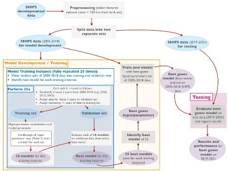
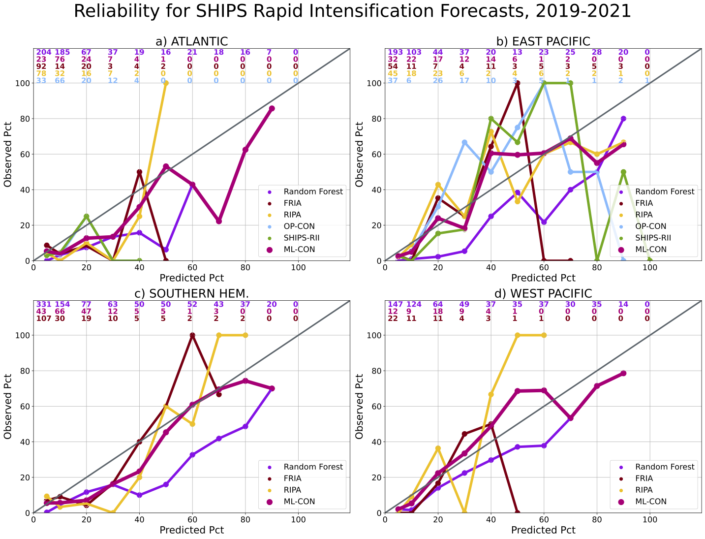

# Machine Learning Model for Tropical Cyclone Rapid Intensification Forecasting
## Overview

This repository contains the machine learning model for tropical cyclone rapid intensification forecasting. This model was trained using the SHIPS Developmental Dataset (available at RAMMB: (https://rammb2.cira.colostate.edu/research/tropical-cyclones/ships/), and following conventions established by operational statistical hurricane intensity forecast models at the National Hurricane Center. A modified version of this model is currently in the research-to-operations pipeline at the National Hurricane Center. 

**Rapid intensification** refers to large changes in tropical cyclone intensity in short periods of time; in this model, we use the 30 kt/24 hour threshold established by Kaplan and DeMaria (1999). Rapid intensification, or RI, is by definition a rare event (occurring in approximately 5% of tropical cyclone forecasts), and is difficult to forecast. RI events are also frequently high-consequence, especially when rapid intensification occurs very closely to landfall. This model was developed with the goal of providing an additional data-driven intensity forecasting model that would improve the performance of the National Hurricane Center's **consensus** rapid intensification forecast. 

Since we are forecasting a rare event, and because tropical cyclone variability from year-to-year and across basins is quite large, we train our model using a bootstrapped model training process (see Figure 1, above). This process will be explained in more detail shortly. 

## Setup
After you have cloned this repo using `git clone`, navigate to the correct directory:
1. Set up the environment file using `conda`: `conda env create -f environment.yml` (note that creating the environment might take a few minutes; don't panic!).
2. Activate the environment using `conda activate SHIPS`. You can deactivate the environment using `conda deactivate`.
3. Run the setup script to create appropriate directories: `python setup.py`

## Data Ingest and Preprocessing

### SHIPS Developmental Dataset
The model is trained on the SHIPS developmental dataset, which is publicly available at RAMMB (https://rammb2.cira.colostate.edu/research/tropical-cyclones/ships/). The SHIPS developmental dataset (DeMaria and Kaplan 1994, Kaplan and DeMaria 1999, NOAA-NESDIS, Cooperative Institute for Research in the Atmosphere, 2023) has been consistently used for statistical forecasts of tropical cyclone intensity and rapid intensification over the past 30 years, with a version of SHIPS running operationally at the National Hurricane Center (NHC) in Miami, FL. The SHIPS developmental dataset is based on climatology, persistence, and a variety of atmospheric, oceanic, and satellite-derived predictors (DeMaria et al. 2005). SHIPS is a perfect prognostic model (Kalnay 2003) meaning it is using best track data for training, rather than forecasts, even though the model is ultimately run on operational data. The SHIPS predictors are calculated from best-track positions and intensity estimates from the NHC (Atlantic and East/Central Pacific) and the Joint Typhoon Warning Center (JTWC, West Pacific and Southern Hemisphere). The best tracks provide the position, intensity, and wind radii of tropical cyclones tracked by the NHC and JTWC at 6-hourly intervals. 

### Reading in and Preparing the Data 
You can download the file yourself to get the most up to date version. Each basin has its own file. The SHIPS model was first created in the 1990s, so it's in a slightly old-fashioned format. We need to read it in line by line. To do that, you can run `SHIPS_reader_v2.py`. This script reads in the SHIPS data line by line, and saves it in a `.csv` format which will be much nicer to work with. Once we've done that, we can run `preprocess_SHIPS_predictors.ipynb` to create our training dataset. Note that we'll need `SHIPS_factors.txt` to scale the data appropriately--due to computational limitations from the 1990s (when SHIPS was developed), the SHIPS developmental data is always saved as `ints` instead of `floats`. `preprocess_SHIPS_predictors.ipynb` performs some feature selection, land masking, and other quality control functions. 

`get_realtime_lsdiags.py` and `preprocess_SHIPS_predictors_REALTIME.ipynb` read in and preprocess the SHIPS realtime data files, respectively. 

*A note about realtime evaluation:* The SHIPS developmental model is a perfect prognostic model, and it's updated at the end of every season after the best-track tropical cyclone data has been released. Thus, SHIPS developmental data is not available in realtime. Since we ultimately want this model to run in realtime at the National Hurricane Center, we evaluate the model on both developmental data and on the realtime data that it would be ingesting in realtime. While the developmental data is publicly available, the realtime data isn't. Some of the realtime code is included in this repo, but you won't be able to run it unless you have your own access to the realtime data. 

Finally, `SHIPS_dev_data_explore.ipynb` is a notebook that explores the SHIPS developmental dataset for people who are not as familiar with statistical forecasting of tropical cyclone intensity. This notebook shows some visualizations such as number of rapid intensification events per basin per year, and intensity change forecast distributions. 

## Model Training
For this baseline model, we implement the most straightforward version of the rapid intensification problem–a binary classification model that identifies SHIPS cases as RI (“yes”) and not-RI (“no”).  We train samples from all ocean basins together for the purposes of increased sample size and better generalizability. We can evaluate model performance on individual basins separately, as well as all basins together. 

Figure 1, above, shows the bootstrapped experimental setup we use for training. We use the period of 2005-2018 as our training period–access to IR satellite data from years prior to 2005 is limited, so we don’t include earlier years. The years 2019 and beyond are held out for model testing. Our model development and training process consists of 25 separate training instances. For each training instance, we randomly choose 3 years from our training period, and hold those out for validation; and we assign the remaining years to the training set. We perform hyperparameter optimization on the training set, evaluate using the validation set, and identify the best model for that training instance. We repeat this process 25 times, giving us 25 “best guess” models, one for each training instance. 

We use this bootstrapping approach for several reasons:
–It allows us to split training and validation data by year (instead of a naive split), which prevents information leakage;
–By using a 3-year validation sample instead of a more standard leave-one-year-out cross-validation approach, we reduce the likelihood of validating on (and potentially overfitting to) outlier years, as year-to-year variability in tropical cyclone activity can be substantial;
–It gives us some uncertainty quantification for our model

`TRAIN_all_models.ipynb` and `TRAIN_all_models.py` are Jupyter notebook and Python script versions that train the model (use the Python script version if you want to do 25 full training instances). 

## Model Evaluation

Once we complete the bootstrapped training process, we identify the best model across all 25 of our training instances, and we use those parameters to train a best-guess model using our full 2005-2018 training sample, with stratified k-means cross-validation. We test our model by predicting rapid intensification on samples from 2019 and beyond. We train three different random forest models, each of which handles the class imbalance problem in a different way, as well as a logistic regression model for a baseline. The different methods of handling class imbalance were explored as part of McGovern et al. (2024), which was a study on data bias in AI models. The trained models have been provided in the `trained_models` subdirectory. You should be able to open the files with `pickle.load(open(model_name, 'rb'))`. `Test_SHIPS_2019-2021.ipynb` and `Test_SHIPS_2019-2021.py` provide an example of evaluation on 2019-2021 data. 

Note again that we've provided code to evaluate the random forest models using realtime data (`Test_realtime_SHIPS_2019-2021.ipynb`/`Test_realtime_SHIPS_2019-2021.py`), but as stated earlier those require the not-publicly-available realtime SHIPS files to run. 

I haven't included the results here, as this work is in the process of being written up for publication, but I'm happy to provide figures upon request. 

### Getting additional data for evaluation
We use some additional files for evaluation--namely the best tracks, which contain the post-hoc verified forecast information about each tropical cyclone; and the e-decks, which contain the probabilistic rapid intensification forecasts. `get_best_track.py` fetches the best tracks from our local CIRA repos, while `get_edecks_2019.py` and `get_edecks_2020.py` get the e-decks from our local repos (note that the formatting of the e-decks changed between 2019 and 2020, so we have different file readers for 2019 and 2020 and beyond). Like the developmental data, these files must be read in line-by-line. 

### Reliability Diagrams
In addition to evaluating our models using classification reports, confusion matrices, precision vs recall curves, reciever-operator curves, and categorical performance diagrams, we also construct reliability diagrams to evaluate two things:
1) How did our model perform against the existing operational statistical rapid intensification foreacsts?
2) Did our model improve the operational consensus forecast?

We provide a sample reliability diagram where we examine forecasts from 2019-2021 (below). Our model is in purple, while the existing consensus is in blue (only available in Atlantic and East Pacific). The consensus forecast that includes our ML model is in pink. On this diagram, a perfect model would be along the one to one line, so we can see that the RF-RI model improves the consensus forecast for the 2019-2021 forecasts, especially at higher probabilities of rapid intensification. 

. 

